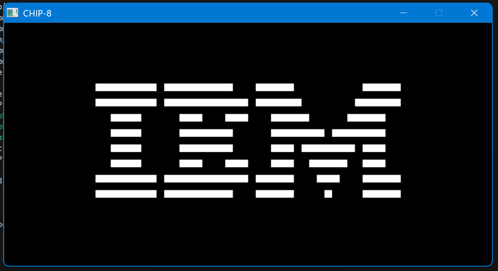

# CHIP-8 Emulator

A CHIP-8 emulator written in C with SDL2. Built as a learning project to get hands-on with emulation, low-level C, and eventually work up to a full NES emulator.

---

## What is CHIP-8?

CHIP-8 is an interpreted programming language from the 1970s, originally designed to make game development easier on early microcomputers. It's not a real hardware system — it's a virtual machine that runs on top of whatever hardware you have.

It has:
- 4KB of memory
- 16 general purpose registers (V0–VF)
- A 64x32 pixel monochrome display
- A 16-key hex keypad
- 35 opcodes

It's become the "hello world" of emulator development because it's simple enough to build in a weekend but teaches you everything you need to know before tackling something like the NES or Game Boy.

---

## Status

This is a work in progress. Here's where things are at:

**Working**
- CPU fetch/decode/execute loop
- ROM picker — scans a directory and lets you choose a ROM at launch
- SDL2 window and renderer
- Opcodes: `00E0`, `1NNN`, `6XNN`, `7XNN`, `ANNN`, `DXYN`
- IBM Logo ROM

**In progress / TODO**
- Remaining opcodes
- Keyboard input
- Timers (delay + sound)
- Subroutine support (`00EE`, `2NNN`)
- Build script
- Cross platform builds

---

## Built with

- C
- SDL2
- CMake